# Travail Pratique — Sécurisation d’une Application E-Learning avec OAuth2 / OpenID Connect (Keycloak + React + Spring Boot)

## Introduction

Ce TP a pour objectif de mettre en œuvre une **solution complète d’authentification et d’autorisation** pour une application web moderne.
Nous avons utilisé **Keycloak** comme serveur d’identité, **Spring Boot** pour le backend et **React** pour le frontend.
L’objectif principal était de sécuriser les communications, gérer les rôles utilisateurs et contrôler l’accès aux ressources sensibles.

---

## Schéma d’architecture

```
 +------------------+        +------------------+       +------------------+
 |                  |        |                  |       |                  |
 |     Keycloak     | <----> |      React       | <---> |   Spring Boot    |
 |  (Identity       |        |  (Frontend)      |       |  (Backend REST)  |
 |   Server)        |        |                  |       |                  |
 |                  |        |                  |       |                  |
 +------------------+        +------------------+       +------------------+
        ^                           ^                          ^
        |                           |                          |
   JWT tokens                   Token attaché               Vérification
   pour l’authentification     aux requêtes API            JWT et rôles
```

* **Keycloak** : gestion des utilisateurs, rôles et tokens JWT.
* **React** : frontend sécurisé avec Keycloak JS adapter, accès conditionnel selon rôle.
* **Spring Boot** : backend REST sécurisé avec Spring Security, validation JWT et contrôle d’accès par rôle.


## I. PARTIE 1 — Configuration du serveur d’identité Keycloak

1. **Installation et lancement**

    * Keycloak a été lancé en **mode dev** via Docker.
    * Configuration de l’administrateur `admin / admin`.

2. **Création du Realm**

    * Realm `elearning-realm` créé pour notre application.

3. **Création des rôles**

    * `ROLE_ADMIN` pour les administrateurs.
    * `ROLE_STUDENT` pour les utilisateurs standards.

4. **Création des clients**

    * Client `react-client` pour le frontend React.
    * Configuration de l’accès public et de la redirection vers `http://localhost:3000`.

5. **Création des utilisateurs**

    * `admin1` avec `ROLE_ADMIN`.
    * `user1` avec `ROLE_STUDENT`.

6. **Gestion des tokens**

    * Les tokens JWT contiennent les informations de l’utilisateur et les rôles.

Les configurations Keycloak ont été exportées dans un fichier `realm-export.json` situé dans dans le repertoire `keycloak`.
Cependant les utilisateurs sont à recréer car ils ne sont pas pris en compte dans l'export.

## II. PARTIE 2 — Sécurisation du backend Spring Boot

1. **Configuration Spring Security**

    * Activer `@EnableMethodSecurity` pour sécuriser les endpoints par annotation.
    * Définition des routes sécurisées via `@PreAuthorize`.

2. **JWT Authentication Converter**

    * Conversion des rôles Keycloak (`roles` dans `realm_access`) en `ROLE_*` pour Spring Security.

3. **CORS et CSRF**

    * CORS configuré pour autoriser les requêtes depuis `http://localhost:3000`.
    * CSRF désactivé pour simplifier le développement front-back.

4. **Endpoints sécurisés**

    * `GET /courses` accessible à `ROLE_STUDENT` et `ROLE_ADMIN`.
    * `POST /courses` accessible uniquement à `ROLE_ADMIN`.
    * Endpoint `GET /me` pour vérifier les informations du token.

### Quelques illustrations : 

- Demande de token à keycloak pour user1
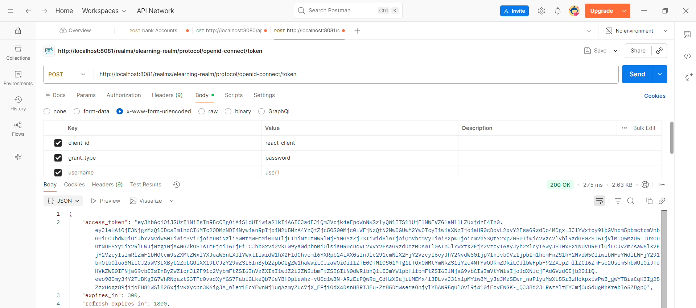
- user1 voit les cours disponibles
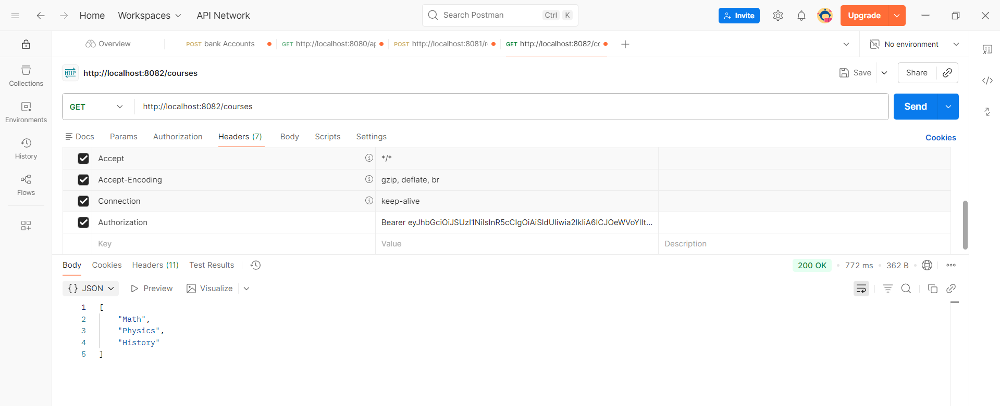
- user1 demande les détails de son profil
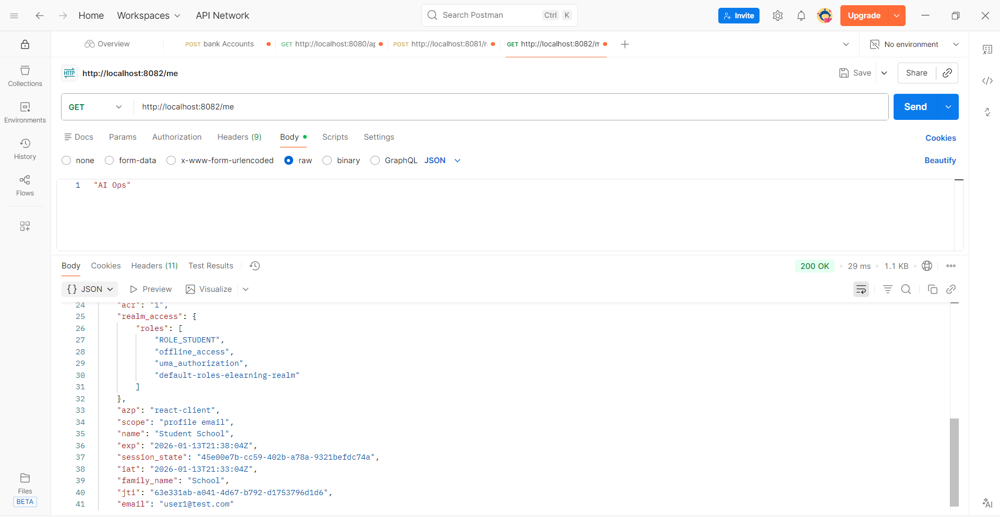
- user1 tente d'accéder aux cours avec un faux token, erreur 401 (unauthorized)
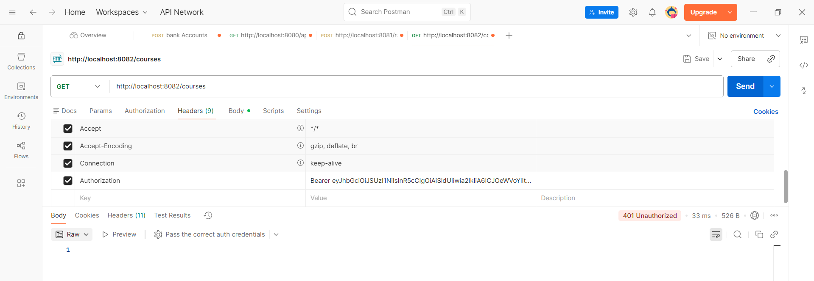
- user1 tente d'accéder aux cours sans token, erreur 401 (unauthorized)
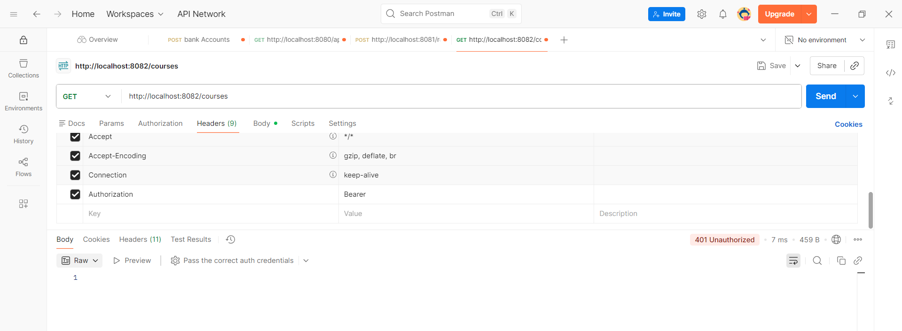
- Demande de token à keycloak pour admin1
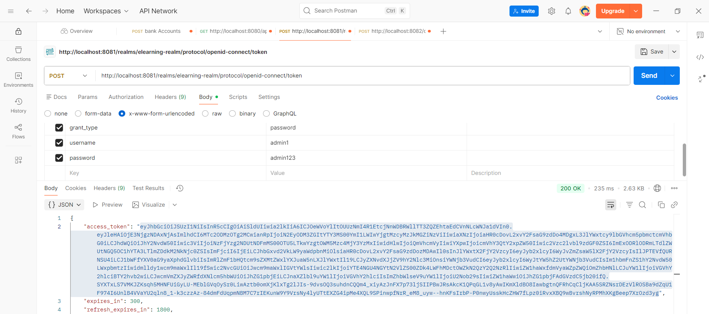
- admin1 fait un post (ajout de cours)
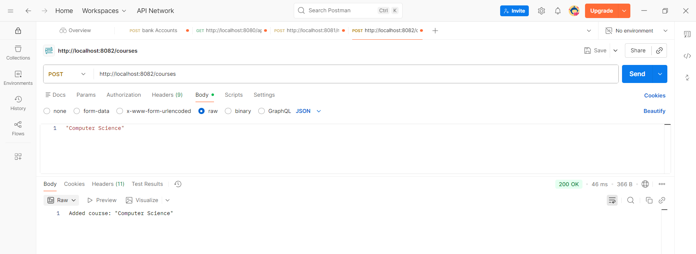
- user1 tente un post, erreur 403 (forbidden)
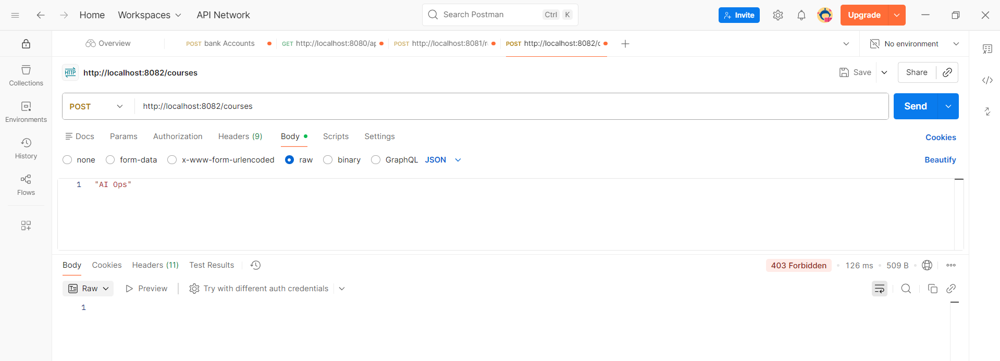


## III. PARTIE 3 — Intégration du frontend React avec Keycloak

1. **Keycloak JS Adapter**

    * Initialisation via `keycloak-js`.
    * `AuthProvider` pour fournir le contexte de l’authentification aux composants React.

2. **Gestion des rôles et des accès**

    * `ProtectedRouteAdmin` pour sécuriser les routes réservées aux admins.
    * Affichage conditionnel des composants selon le rôle (`Courses`, `AdminPanel`).

3. **Affichage du profil utilisateur**

    * Affichage du nom, prénom, email et rôle depuis le token JWT.
    * Bouton `Logout` pour terminer la session.


## IV. PARTIE 4 — Communication sécurisée React → Spring Boot

1. **Injection du token JWT dans les requêtes**

    * Création d’un wrapper Axios (`api.js`) qui ajoute `Authorization: Bearer <token>` à chaque requête.

2. **Accès conditionnel côté backend**

    * Spring Security vérifie le token et les rôles pour chaque requête.
    * Réponses 401 ou 403 renvoyées si l’utilisateur n’est pas authentifié ou n’a pas le rôle requis.

3. **Test de fonctionnement**

    * `user1` : accès aux cours mais pas à l’admin panel.
    * `admin1` : accès aux cours et à l’admin panel.
    * Token expiré → 401.

### Quelques illustrations :

- accès à la page des cours par user1

- info du user1 via /userinfo
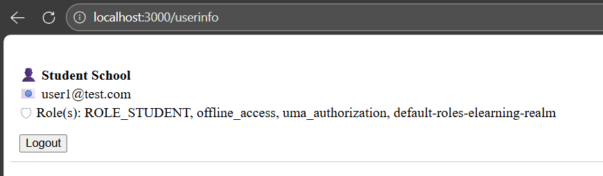
- erreur 401 au bout du temps de validité du token
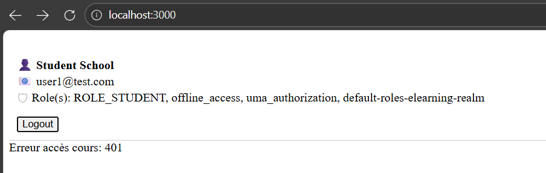
- accès à la page des cours par admin1
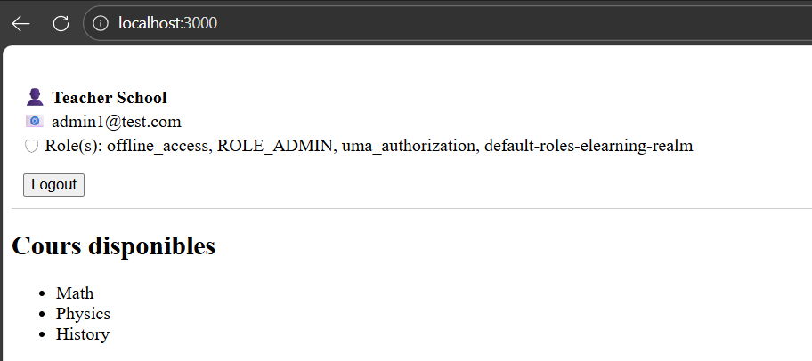
- info de admin1 via /userinfo
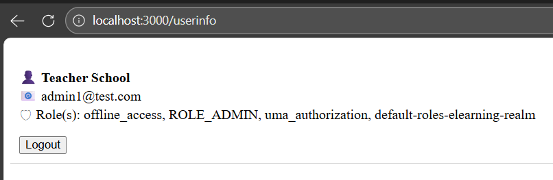
- accès à la page admin via /admin par admin1. user1 n'a pas l'accès, lorsqu'il tente il est redirigé vers la page des cours
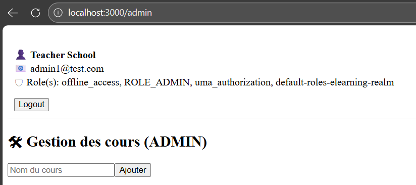
- ajout d'un cours par l'admin
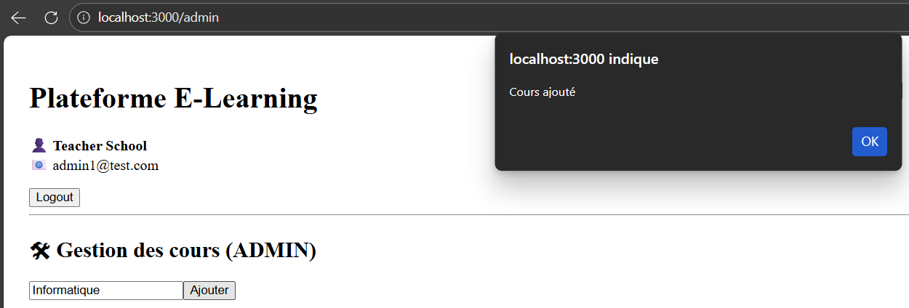

---

## Conclusion

* Le TP a permis de mettre en place une **architecture sécurisée** complète : Keycloak ↔ React ↔ Spring Boot.
* Les utilisateurs et rôles sont gérés via Keycloak.
* Le frontend consomme le backend de façon sécurisée avec JWT.
* Le backend valide les tokens et applique les contrôles d’accès par rôle.
* Ce TP illustre les bonnes pratiques pour la **sécurisation des applications web modernes** avec OAuth2 / OpenID Connect.

---

## Réalisé par :

- **Nom :** Wendbénédo Albéric Darius Konsebo
- **Module :** Sécurité des Systèmes Distribués
- **Encadré par :** M. Abdelmajid BOUSSELHAM
- **Année académique :** 2025 - 2026
